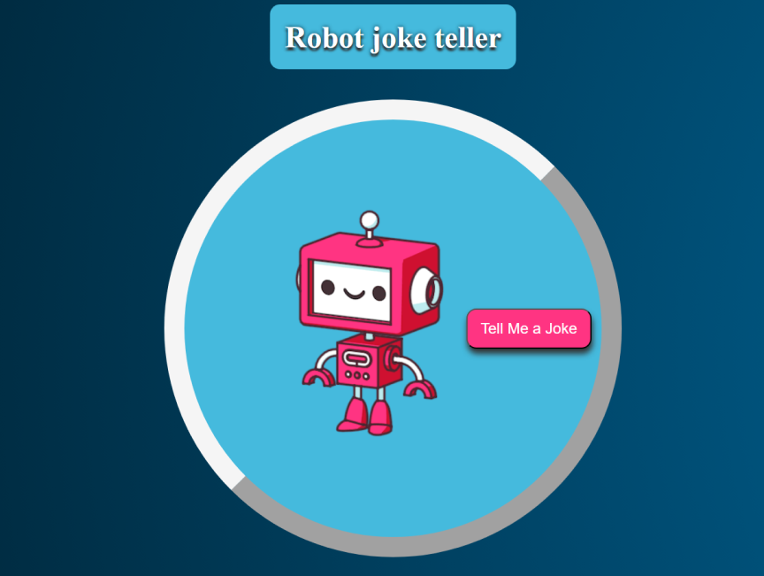

# Robot Joke Teller

## Login

To get access to the app's content you need to run it into your browser.

## Content

After loading page, user needs to click on a button to activate joke robot teller.

Button is disabled as long as audio element isn't finished with talking jokes.

Robot gif was cloned from a giphy, audio API is enabled over VoiceRss Javaskript SDK.  
Jokes are taken from Joke API. 

## Used API links
* Jokes: https://sv443.net/jokeapi/v2/
* Audio: https://www.voicerss.org/sdk/
* Gif image: https://giphy.com/ 

# 👉 Built with
* HTML5
* CSS3
* JS

# 💻 Development
1. run index.html on your browser
2. git clone https://github.com/valerijadrinek/robot-joke-teller.git
3. github pages https://valerijadrinek.github.io/robot-joke-teller/
